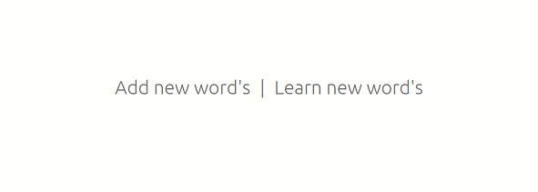
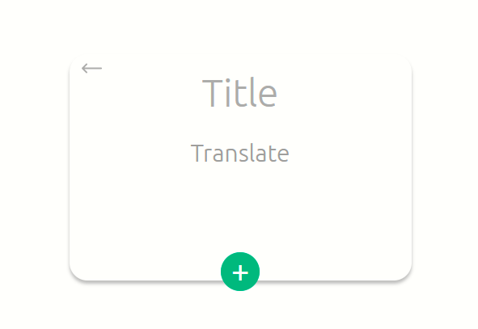
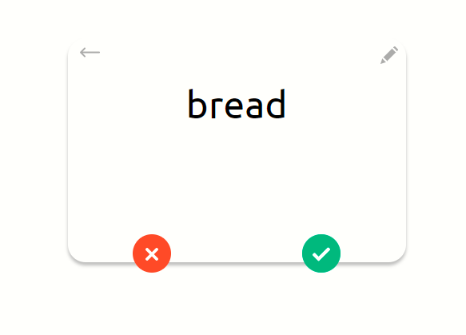

# aWords
> Mini project for learning words with using 3R

## Table of contents
* [General info](#general-info)
* [Screenshots](#screenshots)
* [Technologies](#technologies)
* [Setup](#setup)
* [Features](#features)
* [Status](#status)
* [Contact](#contact)

## General info
https://fil-awords.herokuapp.com/
I don't want to pay for apps for learning words therefore I have created an app for myself and my portfolio.

## Screenshots

  


## Technologies
* 3R = React, Redux, Redux Toolkit

## Setup
```code
npm i
npm install
```

## Code Examples
Show examples of usage:
```js          
            for (let i = 0; i < state.dataBase.length; i++) {
                const el = state.dataBase[i];
                boxes.forEach(item => {
                    if (item.number === el.box && el.time + item.time <= Date.now()) {
                        state.learning.push(el)
                    }
                })
            }
```

## Features
List of features ready and TODOs for future development
* Unique system for learning words, built on the system of spaced repetition
* Adding, editing, learning words 
* Good design 

To-do list:
* Rewrite database on the firebase technology
* Implement login and sign-in system

## Status
Project is: _in progress_ <br/>
I will improve and add new functionality for this project.


## Contact
Created by [@filicaliva](https://www.linkedin.com/in/vfilimonchuk/) - feel free to contact me!
